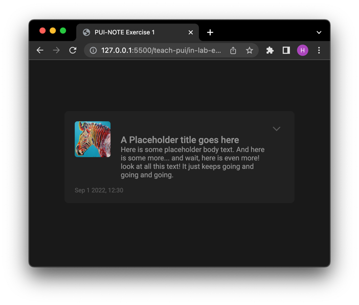
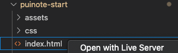
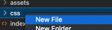

# Lab Exercise 01

Over the next six lab sessions, we will be developing a "sticky-note" application, as seen <a href="https://interactive-structures.org/teach-pui/in-lab-examples/puinote-complete/">here</a>. Today, we will focus on creating a simple layout for one of the "notecard" elements:



## Introduction

In this lab exercise, we will:
- Create a simple layout for a "notecard"
- Understand the CSS box model
- Apply custom fonts and colors to HTML elements


## Adding an Element

Let's start by adding a box that will become our notecard. The `<div>` element is the generic content container, so we'll use that.

1. In the body of `index.html`, add a `<div>` tag. In the tag, include a CSS class called `notecard`, so that we know what this element represents.

```
<body>
    <div class="notecard">
    </div>
</body>
```

2. Add some short placeholder text between the `<div></div>` tags, and save your file.

```
<div class="notecard">
    Write a few words here!
</div>
```

3. Take a look at your page in the browser. (Right-click on "index.html" -> "Open with Live Server"). You should see your newly added element on the screen.



---

## Adding a Style

When first laying out elements, it can help to give them a unique background color, even if it's only temporary. This allows us to catch positioning issues we might otherwise miss.

To add a background color, we'll need to use a stylesheet.

4. In the `<head>` section, add a link to an external stylesheet.

```
<head>
    <link rel="stylesheet" href="css/style.css">
</head>
```

5. This stylesheet doesn't exist yet, so let's create it. In the `css` folder, create a new file named `style.css`. (You can right-click the css folder and select "New File".)
 


6. In `style.css`, define a class named `.notecard`. Add a background color of your choice, and save the file.

```
.notecard {
  background-color: green;
}
```
Be sure to include the `.` prefix before the class name, and a `;` after the CSS rule!

7. Save the file, and view your page in the browser. Does the result look like what you expected?

---

## Height, Width, and Margins

You may have noticed that our notecard element is very wide – the background color extends beyond our placeholder text.

By default, block-level elements will expand horizontally to cover 100% of their parent container. The parent of our notecard is the `<body>` element, so our notecard expands to the width of the entire page.

Our element doesn't look much like a notecard at this point, so let's adjust the dimensions:

8. Within the `.notecard` class, set a width of 450 pixels and a height of 200 pixels. Add rounded corners with a radius of 8 pixels.

```
.notecard {
    width: 450px;
    height: 180px;
    border-radius: 8px;
    background-color: green;
}
```

Let's give our element a bit of breathing room:

9. Add a new CSS rule in the `.notecard` class, adjusting the top margin to 100 pixels.

```
    margin-top: 100px;
```

In Chrome, right-click the notecard and select "Inspect Element". Scroll to the bottom of the "Styles" section and you will see a representation of our notecard -- a blue content box with dimensions 450x150 px, and an orange margin of 100 px on top. Take note of this Chrome feature, it can be a helpful aid when debugging layouts.

Block-level elements like our notecard are left-aligned by default. How do we center the element within its parent container?

10. First, try adding a left margin to our `.notecard` class.

```
    margin-left: 100px;
```

That's a little closer to the center... but it's not really what we want.

11. Change the value of the left-side margin to `auto`. The browser will automatically expand this margin so that it takes up all of the empty horizontal space.

Notice that the left-side margin has now pushed our element all the way to the right side of the screen! (That's useful in some cases, but still not what we're looking for.)

12. Add a right-side margin (`margin-right`) with a value of `auto`. These two margins now "push against each other", and center our notecard horizontally.

13. If you like, you can replace the three margin rules with this more concise syntax:
```
    margin: 100px auto 0px auto;
```

Those four values set the margin on the top, right, bottom, and left side of element, respectively. The choice of syntax is up to you! Use whatever is easier to read at a glance.

---

## Padding and Bounding Boxes

Take a look at the placeholder text in the browser -- notice that it's right up against the edge of our notecard. We can add a bit of a buffer zone with the `padding` rule.

Padding can be applied to each side of our box individually, just like a margin. Alternatively, we can add a uniform padding to all sides of our element.

14. Apply a uniform padding of 20 pixels to the notecard.
```
    padding: 20px;
```

(Note: this syntax works for uniform margins too.)

Take a look at the notecard element in the Chrome Developer Console (right-click the notecard and select "Inspect"). In the "Styles" tab, toggle the padding you just added by unchecking and checking the `padding` checkbox. Observe what happens to the notecard element.

Earlier, we set a width of 450 pixels for the notecard element. By default, this width applies to something called the "Content Box" – and it does *not* include any padding. In the Developer Console, scroll down to the box representation and take a look at the box representation. The blue content box should be shown with dimensions of 450 x 150 pixels, and the green padding adds an additional 20 pixels to each side. From edge to edge, our gray notecard is now 490 pixels wide (450px + 20px + 20px).

This is not always desirable! Often, we would like our defined width to *include* the padding.

15. Add a sizing rule to the notecard class, like so:
```
    box-sizing: border-box;
```

Go back to the Developer Console and toggle the padding again. Observe the results – the notecard width is now consistent, and the padding is instead added to the "inside" of the element. Notice that the width of the blue "Content Box" is now 410 pixels after the padding is added.

---

## Nested Elements and Horizontal Positioning

Right now, our `notecard` element is a `<div>` that contains placeholder text. But a `<div>` element can contain more than just text – we can nest additional `<div>` elements inside it.


Take a look at the notecard mockup from earlier. We can divide this notecard into two sections – a main area on the left (holding note text and images), and a sidebar on the right (holding collpase, edit, and delete icons).

16. Inside the `notecard` element, add two `<div>` elements representing the left and right sections of the notecard. Add class names accordingly.
```
<div class="notecard">
    <div class="notecard-left">
        L
    </div>
    <div class="notecard-right">
        R
    </div>
</div>
``` 

Save your file, and view your page in the browser. The newly added `notecard-left` and `notecard-right` elements are *children* of the `notecard` element.

17. Add a different background color for each of the new notecard elements.
```
.notecard-left {
    background-color: blue
}
.notecard-right {
    background-color: green
}
```

Notice that by default, each of the elements expand to reach 100% of the parent width. Also notice that the elements are stacked on top of each other. How can we position these elements so that they are side by side?

Your first instinct might be to adjust the width of each element. We can give this a shot:


18. Set the width of `notecard-left` to 60% of its parent's width. Set the width of `notecard-right` to 40% of its parent's width.
```
.notecard-left {
    width: 60%;
    background-color: blue;
}
.notecard-right {
    width: 40%;
    background-color: green;
}
```

We've chosen proper widths, but the elements still appear on top of each other. As it turns out, regardless of their widths, block-level elements (such as `<div>`) will always stack on top of each other – each new `<div>` will be placed on a new line.

To make these elements sit side-by-side, on the same line, we will first modify the *parent* element.

19. In the `notecard` class, add a new display rule as shown:
```
    display: flex;
```

We have now converted `notecard` into a ***flex container***, and its two child elements, `notecard-left` and `notecard-right`, are now ***flex children***. Unlike standard block elements, which always appear on a new line, ***flex children*** try to get as close to each other as possible. Notice that `notecard-left` and `notecard-right` are now on the same line!

Also notice that by default, flex children stretch vertically until they reach the height of their parent element.

Take another look at the notecard mockup. Currently, the sidebar width is 40% of our notecard, but we would like it to be a fixed value:

20. Let's change the width of `notecard-right` to 30 pixels.
```
.notecard-right {
    width: 30px;
}
```

You should notice a couple changes – the sidebar width is now correct, but it is not on the right side of the notecard. Recall that by default, flex children try to sit as close to each other as possible. How can we push the sidebar to the right side?

One way to solve this is by adding a left margin, as we did earlier in this excercise.

21. Add an `auto` margin to the left side of `notecard-right`.
```
    margin-left: auto
```
Just as before, the browser expands this margin as much as it can, pushing `notecard-right` to the right side of its parent element.

Now, let's set the width of `notecard-left`. We'd like it to take up the remaining space in the notecard – it should be the full notecard width, minus the width of the 30 pixel sidebar. Let's look at a couple ways of doing this.

22. Use the CSS `calc()` function to set the width of `notecard-left`:
```
    width: calc(100% - 30px);
```

Since we're defining the width in terms of both a percentage *and* a pixel value, we have to use the CSS `calc` function. But this works! Check the browser, and you should see that `notecard-right` is 380 pixels wide.

Still, what happens if we later decide to change the width of `notecard-right`? Our width for `notecard-left` would now be outdated and incorrect.

What we would really like is for `notecard-left` to extend as far as it can go without squishing the 30 pixel sidebar. Perhaps if we set the width to `auto`?

23. For `notecard-left`, remove the previous width rule, and instead add `width: auto`.

No luck! But we've discovered one of the unique features of flex children. Unlike standard block elements, which expand as far as possible when using `auto` width, flex children will not expand beyond their contents when using `auto` width. Notice that as soon as the text ends, the background color ends.

What else can we try?

24. Add the following property to `notecard-left`:
```
    flex-grow: 1:
```

The `flex-grow` property applies only to flex children, and determines how they will behave when there is extra space around them. Since we set `flex-grow` to `1`, the `notecard-left` element will try to expand into the unused space. Looks good!

We are almost done with the sidebar layout, but there's a small hidden problem here. In `index.html`, modify the `notecard-left` content to include a long-ish sentence:

```
<div class="notecard-left">
    I've replaced the letter "L" with a long-ish sentence,
    that's a bit more representative of what actual
    content might look like.
</div>
```

Now take a look at what's happened to `notecard-right` (right click -> Inspect). Scroll down the box representation, and notice that the width of `notecard-right` is *less* than 30 pixels! The `notecard-left` element has tried to expand as far as it can, and in doing so, it's squeezing the `notecard-right` element.

Luckily, there is a simple fix here!

25. Add the following property to `notecard-right`:
```
    flex-shrink: 0:
```

Finally, we've solved our sidebar problem. Adding `flex-shrink: 0` will prevent `notecard-right` from shrinking below its specified width of 30 pixels.

To recap, when horizontally positioning elements, we two methods of setting the widths:

**Method 1:**
```
.notecard-left {
    width: calc(100% - 30px);
}
.notecard-right {
    width: 30px;
}
```

**Method 2:**
```
.notecard-left {
    flex-grow: 1;
}
.notecard-right {
    width: 30px;
    flex-shrink: 0;
}
```

Method 1 is (arguably) easier to understand, but if we decide to change the sidebar width, then we have to update both `notecard-left` and `notecard-right`. Method 2 is a bit trickier to understand, but it's more robust, as `notecard-left` adapts automatically.

---

## Boxes Within Boxes

Let's now add some content to the left side of the notecard. Take another look at the mockup – there are four elements that we need to place: (1) the image, (2) the note title, (3) the note body, and (4) the footer/timestamp.


One strategy for planning layouts is to create a system of "boxes within boxes". Then, for each box, commit to laying out the contents either horizontally or vertically.

For example, the note title and note body (highlighted in green, below) can both be contained within a parent box (highlighed in blue), and arranged vertically. Then, the zebra image and the blue box can be arranged horizontally, inside another parent box (highlighted in red) and arranged horizontally. Finally, the red box and the footer text can be arranged vertically inside of `notecard-left`.

Let's open `index.html` and try to create this layout. We'll specify all the elements first, and then add the styles and positioning.

26. Start at the outside and work inward – first create the "red" box and the footer text:


```
<div class="notecard-left">
    <div class="notecard-main-content">
    </div>

    <div class="notecard-footer">
        Footer text goes here
    </div>
</div>
```

27. Now add the zebra image and the "blue" box:

```
    <div class="notecard-main-content">
        

        <div class="notecard-text">
        </div>
    </div>
```

28. Add the expand and collapse button icons:
In `index.html`:
```
<div class="notecard-right">
    <div class="icon icon-expand material-symbols-outlined">
        expand_more
    </div>
    <div class="icon icon-collapse material-symbols-outlined">
        expand_less
    </div>
</div>
```

In `style.css`:
```
.icon {
  width: 30px;
  height: 30px;
  font-size: 30px;
  color: #595959;
}

.icon-collapse {
    display: none;
}
```

29. And finally, we add the note title and note body text.


```
        <div class="notecard-text">
            <div class="note-title">
                A Placeholder Title Goes Here
            </div>
            <div class="note-body">
                Here is some placeholder body text. And here is some more...
                and wait, here is even more! look at all this text! It just
                keeps going and going and going.
            </div>
        </div>
```


(Note that for the `` tag in step 22, we added two properties – the class and the image source. Also note that a closing tag is not necessary.)

If your placeholder sentences were long, you may notice that the content is "overflowing". Let's quickly fix that by modifying the height of the notecard:

30. Change the `height` property of `notecard` to `min-height: 150px`.

The notecard should expand vertically to contain all of the new content.

Let's style and position these elements. We'll start with the title and body text.


31. In `style.css`, create classes for the note title and body. Then update the font size, font weight, and font color:

```
.note-title {
  font-size: 18px;
  font-weight: 500;
}

.note-body {
  font-size: 14px;
  font-weight: 400;
  color: #939393;
}
```

In the Chrome Developer console, highlight the `notecard-text` element. Notice that it contains both the notecard title and notecard body text. We want to position this `notecard-text` element so that it sits to the right of the zebra image (`notecard-thumbnail`).

How will we do this? Just as before, we will convert `notecard-thumbnail` and `notecard-text` into *flex children*. Recall the flex children will try to get as close together as possible, meaning that they will sit on the same line by default.

32. Find the parent element of `notecard-thumbnail` and `notecard-text`. Add a `display: flex` rule, which will turn the child elements (`notecard-thumbnail` and `notecard-text`) into flex children.
```
.notecard-main-content {
    display: flex;
}
```

Check the mockup – the horizontal and vertical layout is complete! All that's left is fine-tuning.

---

## Image Sizing and Finishing Touches

33. Add a class for the thumbnail image, and adjust the width and height:

```
.notecard-thumbnail {
    width: 70px;
    height: 70px;

  object-fit: cover;
}
```

The `object-fit: cover` property positions the image so that it covers the entire 70x70 px area. It will be scaled down, but keep the same aspect ratio. Any parts of the image that fall outside of the 70x70 area will be clipped. This is useful for cases where our image isn't an exact square, but needs to fit into a square.

34. Add rounded corners to the image:
```
  border-radius: 5px;
```

Let's put some space between the image and the note text, so it looks more like the mockup.

35. Add a 26 pixel `margin-top` and 20 pixel `margin-left` to `notecard-text`.

36. Add a 10 pixel `margin-bottom` to `note-title`.

Almost there! All we have to do now it format the footer.


37. Add a `notecard-footer` class, and adjust the font and margins:
```
.notecard-footer {
    margin-top: 15px;
    font-size: 12px;
    color: #595959;
}
```

38. In `index.html`, swap the placeholder text in the footer with an example timestamp.
```
<div class="notecard-footer">
    Sep 1 2022, 12:30
</div>
```

39. Add two more `notecard`s and change thumbnail pictures.

And we're done! You can change the background colors now if you like – the mockup uses `#212121`.


<!-- ## Nested Elements

Right now, our `notecard` element is a `<div>` that contains placeholder text. But a `<div>` element can contain more than just text – we can nest additional `<div>` elements inside it.

16. Inside the `notecard` element, add two `<div>` elements representing the notecard title text and notecard body text:
```
<div class="notecard">

    <div class="note-title">
        Here is a Sample Title.
    </div>

    <div class="note-body">
        And here is some sample body text.
    </div> 

</div>
```

Save your file, and view your page in the browser. The newly added `note-title` and `note-body` elements are *children* of the `notecard` element.

Let's add another child to our `notecard` element – an image.

17. Add the `warhol-zebra.png` image to the top of the notecard:

```
<div class="notecard">
    
    ...
</div>
```

Notice that by default, all of these elements stack vertically. For example, the title text appears below the zebra image, not to the right.

18. At this point, we might also want to modify the height of our `notecard` element. Change the height from `150px` to `auto`, and the notecard will adapt to fit our newly added content.

---

## Font Face, Size, Color, and Weight

Let's define a default font for our application. For changes such as this, it makes sense to style the `body` element.

19. Use a sans-serif font for the body.
```
body {
    font-family: Roboto, Arial, Helvetica, sans-serif;
}
```

Note that we didn't use the `.` prefix, because we are styling the `<body>` element. The `.` is used only for classes.


20. Choose a default font size and font color. (And while we're styling the `<body>` element, we also set a background color for the page.)

```
body {
    font-family: Roboto, Arial, Helvetica, sans-serif;
    font-size: 14px;
    color: #939393;

    background-color: #191919;
}
```

By default, all children of the `<body>` will inherit this font and color. If we want to override these styles, we can style the child elements directly.

21. Add a CSS class for `note-title` and choose a different color for the title text.

.note-title {
  color: #dddddd;
}

22. We can adjust the font size and font weight as well. Font weights range from 100 (lightest) to 900 (boldest):

```
.note-title {
  color: #dddddd;
  font-size: 18px;
  font-weight: 500;
}
```

23. Finally, while we're here, add a top and bottom margin to the title element.
```
    margin-top: 10px;
    margin-bottom: 10px;
```


---

## Adjusting the Image

24. Add a `notecard-thumbnail` class and adjust the width and height of the thumbnail image:

```
.notecard-thumbnail {
  width: 70px;
  height: 70px;

  /* Add some rounded corners to the image. */
  border-radius: 5px;
}
```
Play around with different `width` and `height` values and take note of how the image is displayed. By default, it will squash and stretch in order to fit into the box that we define. (If you'd rather preserve the aspect ratio, read about the <a href="https://developer.mozilla.org/en-US/docs/Web/CSS/object-fit">object-fit</a> property).
 -->

---

## BONUS: Add a Hover Effect

Let's add a hover effect to the expand/collapse button. At the moment, it won't do anything when clicked, but we'd like it to change color when the user hovers over it.

40. Create a new class named `icon:hover`. Any rules defined in this class will be applied when the user hovers over the `icon` element:

```
.icon:hover {
    color: #dddddd;
    background-color: #393939;
    border-radius: 5px;
}
```

41. One final touch – when the user attempts to interact with `btn-delete`, the cursor should change from an arrow to a hand. Add the following rule to the `btn-delete` class:
```
    cursor: pointer;
```

Congratulations! You've finished Lab 1!

---

## Further Reading (Helpful for Assignment 1)

- HTML `<select>` element (dropdown box): <a href="https://developer.mozilla.org/en-US/docs/Web/HTML/Element/select">link</a>
- CSS Box Model (content, margin, padding): <a href="https://developer.mozilla.org/en-US/docs/Learn/CSS/Building_blocks/The_box_model">link</a>