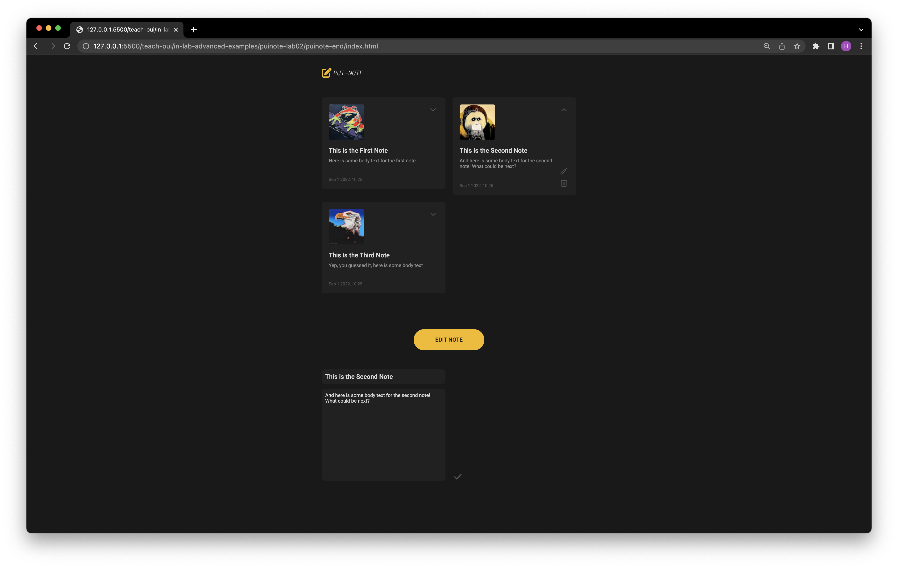

# Lab Exercise 02

Today, we will focus on creating a JavaScript `class` that represents a generic notecard and adding interactive functionalities to "notecard" elements:



## Introduction

In this lab exercise, we will:
- Access HTML elements using `document.querySelector`
- Read and modify the properties of HTML elements
- Write a function that runs when a user clicks on an element (i.e. a "submit" button, in our notes app)
- Create a JavaScript object to represent a "notecard" in our app
- Create a JavaScript `class` that represents a generic notecard, and allows us to make multiple notecards
- Understand the JavaScript `this` keyword

## Adding a JavaScript

Let's start by adding a javascript to `index.html`.

1. Create a new file named `app.js` in the `js` folder. (You can right-click the `js` folder and select "New File".)

2. In the `<head>` section, add a link to an external javascript. The `defer` tag is used to ensure that the script is downloaded in parallel to parsing the page but executed after the page is parsed.

```
<head>
    <script defer src="js/app.js"></script>
</head>
```

## Adding Event Listeners

Let's add expand/collapse functionalities to the notecard.

3. In `app.js`, select expand/collapse buttons using class names.
```
const btnExpand = document.querySelector('.icon-expand');
const btnCollapse = document.querySelector('.icon-collapse');
```

4. Define `expandNote` and `collapseNote` functions to expand/collapse a notecard. 
```
function expandNote() {
  const notecard = document.querySelector('.notecard')
  notecard.classList.add('expanded');
}

function collapseNote() {
  const notecard = document.querySelector('.notecard')
  notecard.classList.remove('expanded');
}
```

5. Add `onclick` listeners to expland/collapse buttons.
```
btnExpand.onclick = expandNote;
btnCollapse.onclick = collapseNote;
```

Let's also change the default state to collapsed by removing the class `expanded` in `index.html`.
```
<div class="notecard" id="notecard-one">
    ...
</div>
```

## Adding an Edit functionality to a notecard

6. First, let's hide the note editor before it is in edit mode by adding a `display: none` property to `#note-editor` in `css/editor.css`:
```
#note-editor {
  display: none;
}
```

7. And change it to `display: block` when it is in edit mode (i.e., has the class `.edit-mode`.
```
#note-editor.edit-mode {
    display: block;
}
```

8. Remove the `edit-mode` class from the note editor (`#note-editor`) in `index.html`.
```
 <div id="note-editor">
    ...
 </div>
```


Now we want to switch to edit mode when the edit button is clicked.

9. In `app.js`, create a function `updateEditor()` to enter the edit mode.
```
function updateEditor() {
  const editorElement = document.querySelector('#note-editor');
  editorElement.classList.add('edit-mode');
}
```

10. Add the `updateEditor()` function as an onclick event to the edit button.


After editing is done, the submit button should update the change in the notecard.
11. Let's create another function `submitNote()` to save the changes.
```
function submitNote() {

}
```

12. Select the title and body elements of the notecard (`.notecard`) using `querySelector`, which will be the targets for update.

```
function submitNote() {
  const notecard = document.querySelector('.notecard');
  const noteTitleElement = notecard.querySelector('.note-title');
  const noteBodyElement = notecard.querySelector('.note-body'); 
}
```

13. Select the title and body elements of the editor (`#note-editor`), which will be the contents for update.
```
function submitNote() {
  ...
  const editorTitleElement = document.querySelector('#note-editor-title');
  const editorBodyElement = document.querySelector('#note-editor-body');
}
```

14. Update the notecard title and body with the new contents in the editor.
```
noteTitleElement.innerText = editorTitleElement.value;
noteBodyElement.innerText = editorBodyElement.value;
```

15. Link the function to the Submit button.
```
const btnSubmit = document.querySelector('#note-editor .icon-done');
btnSubmit.onclick = submitNote
```

16. Close the editor when editing is done.
```
function submitNote() {
  ...
  const editorElement = document.querySelector('#note-editor');
  editorElement.classList.remove('edit-mode');
}
```

## Adding a Notecard `class`

Now we want to have more than one notecard in our app. Let's start by adding two more notecards and managing their functionalities more efficiently with the use of `class`.

17. In `index.html`, generate two more `notecard` elements by copying and pasting `notecard-one` and changine the ids to `notecard-two` and `notecard-three`.
```
<div class="notecard" id="notecard-one">
    ...
</div>
<div class="notecard" id="notecard-two">
    ...
</div>
<div class="notecard" id="notecard-three">
    ...
</div>
```


18. In `app.js`, define a class named `Notecard` with `noteImageURL`, `noteTitle`, `noteBody`, `noteFooter`, and `element` properties. 

```
class Notecard {
  constructor(imageURL, title, body, footer, elementID) {
    this.noteImageURL = imageURL;
    this.noteTitle = title;
    this.noteBody = body;
		this.noteFooter = footer;

    this.element = document.querySelector(elementID);
  }
}
```

19. Assign different properties to each notecard by creating `Notecard` instances.
```
const notecardOne = new Notecard(
  'assets/warhol-frog.png',
  'This is the First Note',
  'Here is some body text for the first note.',
  'Sep 1 2022, 10:25',
  '#notecard-one'
)

const notecardTwo = new Notecard(
  'assets/warhol-orangutan.png',
  'This is the Second Note',
  'And here is some body text for the second note! What could be next?',
  'Sep 1 2022, 10:25',
  '#notecard-two'
)

const notecardThree = new Notecard(
  'assets/warhol-eagle.png',
  'This is the Third Note',
  'Yep, you guessed it, here is some body text for the third note.',
  'Sep 1 2022, 10:25',
  '#notecard-three'
)
```

20. Update the DOM to reflect the new properties by creating an `updateElement()` class function and calling it in the `constructor`.
```
class Notecard {
    constructor(...) {
        ...
        this.updateElement();
    }

    updateElement() {
	const noteImageElement = this.element.querySelector('.notecard-thumbnail');
	const noteTitleElement = this.element.querySelector('.note-title');
	const noteBodyElement = this.element.querySelector('.note-body');
	const noteFooterElement = this.element.querySelector('.notecard-footer');

	noteImageElement.src = this.noteImageURL;
	noteTitleElement.innerText = this.noteTitle;
	noteBodyElement.innerText = this.noteBody;
	noteFooterElement.innerText = this.noteFooter;
    }
}
```

Note that the expand/collapse functionalities only work for the first note now. Why? Because the `querySelector` is selecting the first appearing `.icon-expand` and `.icon-collapse`. These should apply to each notecard item, so let's move these into the class.

Let's move the expand/collapse functionalities into `class Notecard` and modify.

21. Move the `expandNote()` and `collapseNote()` functions into the class.
```
class Notecard {
  constructor(imageURL, title, body, footer, elementID) {...}

  updateElement() {...}
 
  expandNote() {
    this.element.classList.add('expanded');
  }

  collapseNote() {
    this.element.classList.remove('expanded');
  } 
}
```

22. Add the expand/collapse button selectors and onclick event listener registration to construtor. Don't forget to bind `this`.
```
class Notecard {
  constructor(imageURL, title, body, footer, elementID) {
    ...
    const btnExpand = this.element.querySelector('.icon-expand');
    const btnCollapse = this.element.querySelector('.icon-collapse');

    btnExpand.onclick = this.expandNote.bind(this);
    btnCollapse.onclick = this.collapseNote.bind(this);
    ...
  }
}
```

## Improving the Edit functionality
Instead of rewriting a new note, we want to actually "edit" an existing note. When we click an edit button of a notecard, we can update the title and body of the editor with the selected notecard's title and body texts.

23. To do so, we need to know which notecard is selected. Add a variable `selectedNote` in `app.js`.
```
let selectedNote = null;
```

24. Create an `editNote` function in `Notecard` class.
```
editNote() {
  selectedNote = this;
  updateEditor();
}
```

25. Add the `editNote` function as the onclick listener for the edit button in the class constructor. Make sure to delete the original ones outside the class constructor.
```
const btnEdit = this.element.querySelector('.icon-edit');
btnEdit.onclick = this.editNote.bind(this);
```

26. Update the selected notecard information inside `updateEditor()`. 
```
function updateEditor() {
  ...

  const editorTitleElement = document.querySelector('#note-editor-title');
  const editorBodyElement = document.querySelector('#note-editor-body');

  editorTitleElement.value = selectedNote.noteTitle;
  editorBodyElement.value = selectedNote.noteBody;
}

```

The editor loads the selected notecard information now, but the edit changes are not saved to the notecard. Let's modify the `submitNote()` function for the new class structure. 

27. Remove the existing `querySelector`s and use the `selectedNote` instead. 
```
selectedNote.noteTitle = editorTitleElement.value;
selectedNote.noteBody = editorBodyElement.value;
``` 

28. Make sure to update the HTML element after the object properties have been modified so we can see the new changes on screen.
```
selectedNote.updateElement();
```

## Deleting a Note
29. Add `deleteNote()` function to `Notecard` class.
```
class Notecard {
    constructor(...) {
        ...
        const btnDelete = this.element.querySelector('.icon-delete');
        btnDelete.onclick = this.deleteNote.bind(this);
    }

    deleteNote() {
        this.element.remove();
    }
}
```
