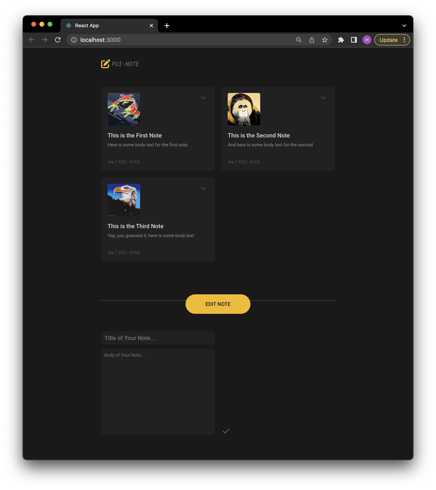

# Lab Exercise 03

Today, we will focus on creating a React component that represents a generic notecard:



## Introduction

In this lab exercise, we will:
- Create a React project
- Create a React Component 

## Create the first React Project

1. Install `create-react-app` by typing the following command in terminal.
```
npm install -g create-react-app
```

2. Create a new React project using `create-react-app`.

```
create-react-app <folder_name>
```
For example,
```
create-react-app puinote
```

3. Run
```
cd <folder_name>
npm start
```


4. Change the base layout structure in `App.js` as we did in Lab 2. Note that we use `className` now in JSX instead of `class`.
```
function App() {
  return (
    <div className="App">
      <div id="container">
        <header>
          
          <h1> PUI-NOTE </h1>
        </header>
        <div id="notecard-list">
        </div>
      </div>
    </div>
  );
}
```

5. Copy the `assets` folder from Lab 2 to `public/assets`.

6. Copy the contents of `css/base.css` from Lab 2 to `App.css`.


7. Create a Notecard class in a separate file `Notecard.js` and its stylesheet `Notecard.css`.

```
import React, { Component } from 'react';

class Notecard extends Component {
  render() {

  }
}
```

8. Inside `render()` function, copy and paste the `notecard` class element from Lab 2. Make sure to change all `class` to `className`.

```
class Notecard extends Component {
  render() {
    return (
      <div className="notecard">         
        <div className="notecard-left">
          <div className="notecard-main-content">
            
            <div className="notecard-text">
              <div className="note-title-container">
                <div className="note-title">
                  Placeholder Title
                </div>
              </div>
              <div className="note-body">
                Here is some placeholder body text.
              </div>
            </div>
          </div>
          <div className="notecard-footer">
            Aug 8 2022, 11:09
          </div>
        </div>
        <div className="notecard-right">
          <div className="icon icon-expand material-symbols-outlined">
            expand_more
          </div>
          <div className="icon icon-collapse material-symbols-outlined">
            expand_less
          </div>
          <div className="toolbar">
            <div className="material-symbols-outlined icon icon-edit">
              edit
            </div>
            <div className="material-symbols-outlined icon icon-delete">
              delete
            </div>
          </div>
        </div> 
      </div>
    );
  }
}
```

9. Export `Notecard` in `Notecard.js` at the end of the file.
```
export default Notecard
```

10 Create a `Notecard.css` and copy-and-paste the contents of `notecard.css` from Lab 2 here.

11. Import `Notecard.css` in `Notecard.js`.
```
import './Notecard.css';
```

12. In `App.js`, add a `Notecard` to the `notecard-list`.
```
<div id="notecard-list">
  <Notecard />
</div>
```

We now have our first `Notecard` React component!

----
## Props 

`props` allow you to pass data from a parent (wrapping) component to a child (embedded) component. Let's pass down `imageURL`, `noteTitle`, `noteBody`, and `noteFooter` dynamically to children notecards.

13. In `App.js`, add the four props to `<Notecard />`.
```
<Notecard 
  imageURL="assets/warhol-frog.png" 
  noteTitle="This is the First Note" 
  noteBody="Here is some body text for the first note." 
  noteFooter="Sep 1 2022, 10:25" />
```

14. In `Notecard.js`, change the title, body, footer, and image source to `this.props.`
```
<div className="notecard-left">
  <div className="notecard-main-content">
    
    <div className="notecard-text">
      <div className="note-title-container">
        <div className="note-title">
          {this.props.noteTitle}
        </div>
      </div>
      <div className="note-body">
        {this.props.noteBody}
      </div>
    </div>
  </div>
  <div className="notecard-footer">
    {this.props.noteFooter}
  </div>
</div>
```

15. Create two more notecards.

```
<Notecard 
  imageURL="assets/warhol-orangutan.png" 
  noteTitle="This is the Second Note" 
  noteBody="And here is some body text for the second note! What could be next?"
  noteFooter="Sep 1 2022, 10:25" />
<Notecard 
  imageURL="assets/warhol-eagle.png" 
  noteTitle="This is the Third Note" 
  noteBody="Yep, you guessed it, here is some body text for the third note." 
  noteFooter="Sep 1 2022, 10:25" />
```

Now we have the notecard list!

---
### Adding the Note Editor

Let's copy over our note editor to `App.js` as well.

16. In `App.js`, add the following code from Lab 2 inside the container. Note again that we use `className` instead of `class`. Also, I added the `edit-mode` class to `#note-editor` to make it visible since we don't have any interactivity yet.

```
<div id="note-editor" className="edit-mode">
  <div id="btn-new-note">
    EDIT NOTE
  </div>
  <div className="note-editor-contents">
    <div className="note-editor-left">
      <form>
        <input id="note-editor-title" placeholder="Title of Your Note..."
          name="dummy" maxLength="50"></input>
        <textarea id="note-editor-body" placeholder="Body of Your Note..."
          rows="15" maxLength="1000"></textarea>
      </form>
    </div>
    <div className="note-editor-right">
      <div className="material-symbols-outlined icon icon-done">
        done
      </div>
    </div>
  </div>
</div>
```