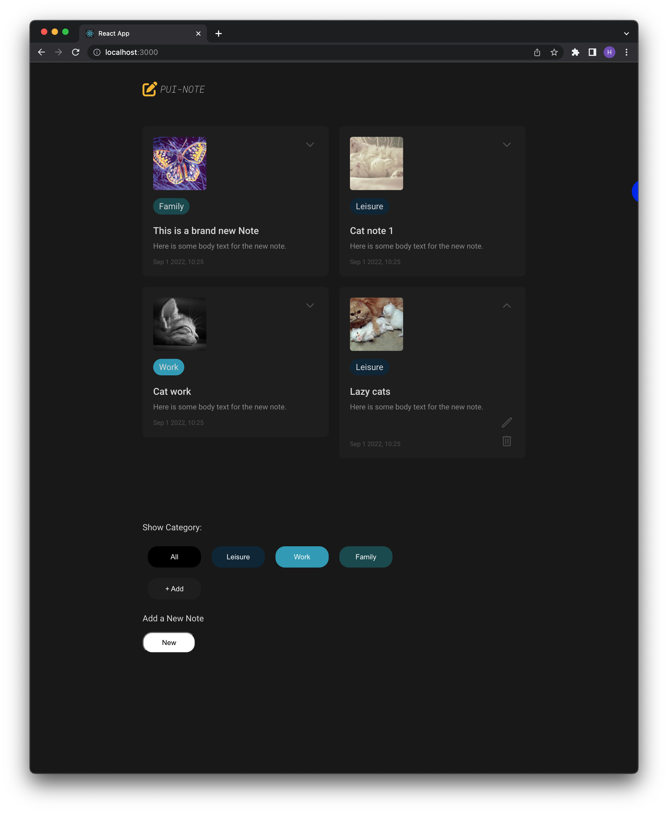

# Lab Exercise 06

Today, we will focus on making persistent changes using `localStorage` and retrieving data from the server using `fetch`:




## Introduction

In this lab, we'll practice:
- Using local storage to store notecard data
- Using local storage with hooks to store notecard categories
- Using `fetch` to retrieve server-side data from TheCatAPI


## Install React-related packages

1. Run the following command to install React-related dependent packages defined in `package.json` in terminal.
```
npm install
```

2. Open the deployment server for live coding.
```
npm start
```


-----
## Store Notecard Data in Local Storage

We can now add, edit, and delete notecards, but as soon as you refresh the page, all the changes you made are gone! Let's store the edits you made in local storage so we can keep your efforts. 

3. In `App.js`, change the manually input data in `notecardData` to reading from the local storage, or creating an empty array if it doesn't exist in the local storage.

```
    this.state = {
      notecardData: JSON.parse(localStorage.getItem("notecardData")) || [],
      ...
    };   
```

We are already reflecting all add/edit/delete changes to `this.state.notecardData`. The only change we need to make is synchronizing the local storage with the state's notecard data.

4. Create the React life-cycle methods `componentDidMount()` and `componentDidUpdate()`. Refer to Lab 4 if you can't recall. 

```
  componentDidMount() {

  }

  componentDidUpdate() {

  }
```

5. Add the `notecardData` item to `localStorage`.

```
  componentDidMount() {
    localStorage.setItem("notecardData", JSON.stringify(this.state.notecardData));
  }

  componentDidUpdate() {
    localStorage.setItem("notecardData", JSON.stringify(this.state.notecardData));
  }
```


Now make any changes and refresh the page! The changes are persistent!


-----
## Store Category List in Local Storage using Hooks

Now, we will practice using local storage with hooks.

Instead of fixed categories, let's add categories dynamically and store them in local storage.

First, let's separate out `CategoryList` from `App.js`.

6. Create a new file `CategoryList.js` containing a stateless component `CategoryList`.

```
import React, { useState } from 'react';
import './App.css';

const CategoryList = () => {
  return (
    <div>
    </div>
  );
}
```

7. As we covered in the lab slides, let's create a custom hook `useLocalStorage`.

```
const useLocalStorage = (storageKey, fallbackState) => {
  const [value, setValue] = useState(
    JSON.parse(localStorage.getItem(storageKey)) ?? fallbackState
  );

  useEffect(() => {
    localStorage.setItem(storageKey, JSON.stringify(value));
  }, [value, storageKey]);

  return [value, setValue];
}
```

8. In this file, we want to store the list of categories in the local storage. Use the `useLocalStorage` for `categoryList`. The "All" category is added as a default item. A category item is a custom object that has `name` and `color` attributes: `{name: ..., color: ...}`.

```
const CategoryList = () => {
  const [categoryList, setCategoryList] = useLocalStorage("categoryList", [
    {name: "All", color: "black"}
  ]);
  ...
}
```

9. Copy over the markup for the category list part from `App.js`. Convert the three buttons into a loop-style rendering. Replace "Work" with `category.name`.

```
  return (
    <div>
      <p>Show Category:</p>
      {categoryList.map(
        (category, idx) => {
          return <button key={idx} style={buttonStyle} onClick={() => {this.filterButtonHandler(category.name)}}>{category.name}}</button>
        }
      )}
    </div>
  );
```

10. Now that we are in a child component, we can't access `filterButtonHandler` using `this`. Let's take it as a `prop` from the parent. 

In `App.js`,

```
<CategoryList filterButtonHandler={this.filterButtonHandler}/>
```

In `CategoryList.js`,

```
const CategoryList = (props) => {
  const filterButtonHandler = props.filterButtonHandler;
  ...

  return (
    ...
    {categoryList.map(
      (category, idx) => {
        return <button key={idx} style={buttonStyle}
        onClick={() => {filterButtonHandler(category.name)}}>{category.name}</button>
      }
    )}
    ...
  );
}
```

11. Create a `categoryButtonStyle` in `CategoryList.js`.

```
const categoryButtonStyle = {
  width: "100px",
  height: "40px",
  borderRadius: "18px",
  margin: "10px",
  color: "white",
  backgroundColor: "black",
  border: "0px"
}
```

12. Replace the style when rendering each category.

```
(category, idx) => {
  return <button key={idx} style={categoryButtonStyle}
  onClick={() => {filterButtonHandler(category.name)}}>{category.name}</button>
}
```

Now, let's add new categories to the list! We'll create a button to add a category and a simple input field to enter the new category's name. When the user clicks the add button, the input will appear. Pressing the add button again after typing in the new category name will perform the add action and close the input field. 

13. Create the add category button first in the markup with a dummy `onClick` function `addNewCategory`.

```
<div><button style={{...categoryButtonStyle, backgroundColor: "#212121"}} onClick={addNewCategory}>+ Add</button></div>
```

14. To determine whether to display the input field or not, create a state variable `isAddingNew` using the `useState` hook. Also, the value of the input field should be tracked. Create another variable `newCategory` using the `useState` hook. 

```
const [isAddingNew, setAddingNew] useState(false);
const [newCategory, setNewCategory] = useState("");
```

15. Conditionally render the input field below the add buton.

```
{isAddingNew && <form>
  <input placeholder="New Category"
    name="dummy" maxLength="10" onChange={handleCategoryChange} value={newCategory}>
  </input>
</form>}
```

16. Define the `handleCategoryChange` funciton.

```
const handleCategoryChange = (event) => {
  setNewCategory(event.target.value);
}
```

17. Write the `addNewCategory` function. This function should toggle the input field and add the new category to the `categoryList` in the component state and local storage. 

```
  const addNewCategory = () => {
    if (newCategory.length > 0) {
      let newCategoryItem = {
        name: newCategory,
        color: "blue",
      }
      setCategoryList([...categoryList, newCategoryItem]);
    }

    // Close the new category input and reset the value
    setAddingNew(!isAddingNew);
    setNewCategory("");
  }
```

Let's diversity the category colors a bit more. Define a color list and pick a color from the list in `addNewCategory`.

18. Define a color list.

```
const colorList = ["#0B2B40", "#30A5BF", "#185359", "#B2BE22", "#A6874E"]
```

19. In `addNewCategory()`, choose the color based on the category index.

```
      let newCategoryItem = {
        name: newCategory,
        color: colorList[(categoryList.length - 1) % 5],
      }
```


Now, we need to reflect these category structure changes for displaying the notecards.

20. First, in `App.js`, retrieve the categories from the local storage and store in state.

```
this.state = {
  categories: JSON.parse(localStorage.getItem("categoryList")) || [],
  ...
}
```

21. Update the `noteCategory` value in the notecard generating part. `noteCategory` now stores a category object `{name: ..., color: ...}` instead of just the name.

```
addNote = () => {
  let newNotecardItem = {
    imageURL: "assets/warhol-butterfly.png",
    noteTitle: "This is a brand new Note",
    noteBody: "Here is some body text for the new note.",
    noteCategory: this.state.categories[0] || "",
    noteFooter: "Sep 1 2022, 10:25"
  }
```

22. Update the conditional rendering part to reflect this change.

```
(notecard, idx) => {
  if ((this.state.filterCategory == "All") || 
  (notecard.noteCategory.name.includes(this.state.filterCategory))) {
    ...
  }
}
```


All new notecards will be generated with the default "All" category. 

Now in the note editor, users can modify the category as well. 

23. Let's reflect these changes in `submitNote()` function. Since the `categoryList` keeps category objects while the editor just modifies the category name, we need to find the corresponding category instance based on the name.

```
const categoryObj = this.state.categories.find((category) => category.name == this.state.editorNoteCategory);
newNotecardData[this.state.selectedNoteIndex].noteCategory = categoryObj
```


24. In `Notecard.js`, the part for accessing category should be updated as well. We also change the category label color to match the color shown in the category list.

```
const categoryStyle = {
  width: "fit-content",
  backgroundColor: this.props.noteCategory.color,
  border: "1px solid",
  borderColor: this.props.noteCategory.color,
  borderRadius: "18px",
  marginTop: "15px",
  padding: "5px 10px"
}

return (
  <div className={notecardClass}>         
  ...
          <div className="notecategory" style={categoryStyle}>{this.props.noteCategory.name}</div>
  ...
  </div>
)
```


-----
## Set a Random Cat Image as the Note Thumbnail Using the Cat API

Instead of setting the same butterfly image from the assets, we will get a random cat image from a server that hosts cat image database (https://docs.thecatapi.com/).

25. Inside `addNote` function, call `fetch` to load "https://api.thecatapi.com/v1/images/search". Parse the json result and add the url as the new notecard's `imageURL`.

```
addNote = () => {
  fetch("https://api.thecatapi.com/v1/images/search")
  .then(res => res.json())
  .then(
    (result) => {
      let newNotecardItem = {
        imageURL: result[0]["url"],
        noteTitle: "This is a brand new Note",
        noteBody: "Here is some body text for the new note.",
        noteCategory: this.state.categories[0] || "",
        noteFooter: "Sep 1 2022, 10:25"
      }
      ...
    }
  )
```


