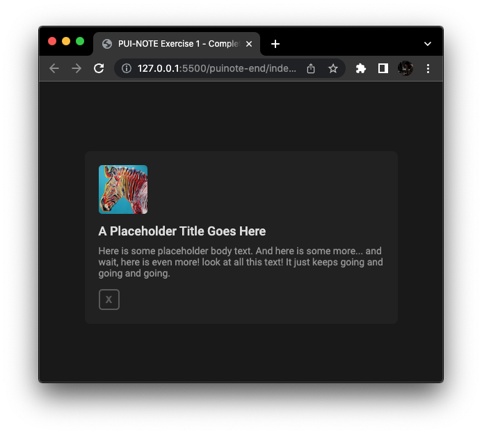

# Lab Exercise 01

Over the next six lab sessions, we will be developing a "sticky-note" application, as seen <a href="https://interactive-structures.org/teach-pui/in-lab-examples/puinote-complete/">here</a>. Today, we will focus on creating a simple layout for one of the "notecard" elements:



## Introduction

In this lab exercise, we will:
- Create a simple layout for a "notecard"
- Understand the CSS box model
- Apply custom fonts and colors to HTML elements

You can download a zip file with all starter code and assets here: https://tinyurl.com/pui-lab01


## Adding an Element

Let's start by adding a box that will become our notecard. The `<div>` element is the generic content container, so we'll use that.

1. In the body of `index.html`, add a `<div>` tag. In the tag, include a CSS class called `notecard`, so that we know what this element represents.

```
<body>
    <div class="notecard">
    </div>
</body>
```

2. Add some short placeholder text between the `<div></div>` tags, and save your file.

```
<div class="notecard">
    Write a few words here!
</div>
```

3. Take a look at your page in the browser. (Right-click on "index.html" -> "Open with Live Server"). You should see your newly added element on the screen.


---

## Adding a Style

When first laying out elements, it can help to give them a unique background color, even if it's only temporary. This allows us to catch positioning issues we might otherwise miss.

To add a background color, we'll need to use a stylesheet.

4. In the `<head>` section, add a link to an external stylesheet.

```
<head>
    <link rel="stylesheet" href="css/style.css">
</head>
```

5. This stylesheet doesn't exist yet, so let's create it. In the `css` folder, create a new file named `style.css`. (You can right-click the css folder and select "New File".)
 


6. In `style.css`, define a class named `.notecard`. Add a background color of your choice, and save the file.

```
.notecard {
  background-color: green;
}
```
Be sure to include the `.` prefix before the class name, and a `;` after the CSS rule!

7. Save the file, and view your page in the browser. Does the result look like what you expected?

---

## Height, Width, and Margins

You may have noticed that our notecard element is very wide – the background color extends beyond our placeholder text.

By default, block-level elements will expand horizontally to cover 100% of their parent container. The parent of our notecard is the `<body>` element, so our notecard expands to the width of the entire page.

Our element doesn't look much like a notecard at this point, so let's adjust the dimensions:

8. Within the `.notecard` class, set a width of 450 pixels and a height of 200 pixels. Add rounded corners with a radius of 8 pixels.

```
.notecard {
    width: 450px;
    height: 150px;
    border-radius: 8px;
    background-color: green;
}
```

Let's give our element a bit of breathing room:

9. Add a new CSS rule in the `.notecard` class, adjusting the top margin to 100 pixels.

```
    margin-top: 100px;
```

In Chrome, right-click the notecard and select "Inspect Element". Scroll to the bottom of the "Styles" section and you will see a representation of our notecard -- a blue content box with dimensions 450x150 px, and an orange margin of 100 px on top. Take note of this Chrome feature, it can be a helpful aid when debugging layouts.

Block-level elements like our notecard are left-aligned by default. How do we center the element within its parent container?

10. First, try adding a left margin to our `.notecard` class.

```
    margin-left: 100px;
```

That's a little closer to the center... but it's not really what we want.

11. Change the value of the left-side margin to `auto`. The browser will automatically expand this margin so that it takes up all of the empty horizontal space.

Notice that the left-side margin has now pushed our element all the way to the right side of the screen! (That's useful in some cases, but still not what we're looking for.)

12. Add a right-side margin (`margin-right`) with a value of `auto`. These two margins now "push against each other", and center our notecard horizontally.

13. If you like, you can replace the three margin rules with this more concise syntax:
```
    margin: 150px auto 0px auto;
```

Those four values set the margin on the top, right, bottom, and left side of element, respectively. The choice of syntax is up to you! Use whatever is easier to read at a glance.

---

## Padding and Bounding Boxes

Take a look at the placeholder text in the browser -- notice that it's right up against the edge of our notecard. We can add a bit of a buffer zone with the `padding` rule.

Padding can be applied to each side of our box individually, just like a margin. Alternatively, we can add a uniform padding to all sides of our element.

14. Apply a uniform padding of 20 pixels to the notecard.
```
    padding: 20px;
```

(Note: this syntax works for uniform margins too.)

Take a look at the notecard element in the Chrome Developer Console (right-click the notecard and select "Inspect"). In the "Styles" tab, toggle the padding you just added by unchecking and checking the `padding` checkbox. Observe what happens to the notecard element.

Earlier, we set a width of 450 pixels for the notecard element. By default, this width applies to something called the "Content Box" – and it does *not* include any padding. In the Developer Console, scroll down to the box representation and take a look at the box representation. The blue content box should be shown with dimensions of 450 x 150 pixels, and the green padding adds an additional 20 pixels to each side. From edge to edge, our gray notecard is now 490 pixels wide (450px + 20px + 20px).

This is not always desirable! Often, we would like our defined width to *include* the padding.

15. Add a sizing rule to the notecard class, like so:
```
    box-sizing: border-box;
```

Go back to the Developer Console and toggle the padding again. Observe the results – the notecard width is now consistent, and the padding is instead added to the "inside" of the element. Notice that the width of the blue "Content Box" is now 410 pixels after the padding is added.

---

## Nested Elements

Right now, our `notecard` element is a `<div>` that contains placeholder text. But a `<div>` element can contain more than just text – we can nest additional `<div>` elements inside it.

16. Inside the `notecard` element, add two `<div>` elements representing the notecard title text and notecard body text:
```
<div class="notecard">

    <div class="note-title">
        Here is a Sample Title.
    </div>

    <div class="note-body">
        And here is some sample body text.
    </div> 

</div>
```

Save your file, and view your page in the browser. The newly added `note-title` and `note-body` elements are *children* of the `notecard` element.

Let's add another child to our `notecard` element – an image.

17. Add the `warhol-zebra.png` image to the top of the notecard:

```
<div class="notecard">
    
    ...
</div>
```

Notice that by default, all of these elements stack vertically. For example, the title text appears below the zebra image, not to the right.

18. At this point, we might also want to modify the height of our `notecard` element. Change the height from `150px` to `auto`, and the notecard will adapt to fit our newly added content.

---

## Font Face, Size, Color, and Weight

Let's define a default font for our application. For changes such as this, it makes sense to style the `body` element.

19. Use a sans-serif font for the body.
```
body {
    font-family: Roboto, Arial, Helvetica, sans-serif;
}
```

Note that we didn't use the `.` prefix, because we are styling the `<body>` element. The `.` is used only for classes.


20. Choose a default font size and font color. (And while we're styling the `<body>` element, we also set a background color for the page.)

```
body {
    font-family: Roboto, Arial, Helvetica, sans-serif;
    font-size: 14px;
    color: #939393;

    background-color: #191919;
}
```

By default, all children of the `<body>` will inherit this font and color. If we want to override these styles, we can style the child elements directly.

21. Add a CSS class for `note-title` and choose a different color for the title text.

.note-title {
  color: #dddddd;
}

22. We can adjust the font size and font weight as well. Font weights range from 100 (lightest) to 900 (boldest):

```
.note-title {
  color: #dddddd;
  font-size: 18px;
  font-weight: 500;
}
```

23. Finally, while we're here, add a top and bottom margin to the title element.
```
    margin-top: 10px;
    margin-bottom: 10px;
```


---

## Adjusting the Image

24. Add a `notecard-thumbnail` class and adjust the width and height of the thumbnail image:

```
.notecard-thumbnail {
  width: 70px;
  height: 70px;

  /* Add some rounded corners to the image. */
  border-radius: 5px;
}
```
Play around with different `width` and `height` values and take note of how the image is displayed. By default, it will squash and stretch in order to fit into the box that we define. (If you'd rather preserve the aspect ratio, read about the <a href="https://developer.mozilla.org/en-US/docs/Web/CSS/object-fit">object-fit</a> property).


---

## BONUS: Button with Hover Effect

Let's add a "delete note" button to the bottom of our notecard. (Example <a href="https://interactive-structures.org/teach-pui/in-lab-examples/puinote-lab01/puinote-end/">here</a>). At the moment, it won't do anything when clicked, but we'd like it to change color when the user hovers over it.

25. Start by adding the button element in `index.html`, as a child of our `notecard` element:

```
<div class="notecard">
    ...
    <button class="btn-delete">
        X
    </button>
</div>
```

Save your file, and take a look at the browser – you should see the newly added button with some default styling.

26. Let's strip away some of the default styles, and add our own. In `style.css`, add a `.btn-delete` class. Start by adjusting the width, height, margin, and padding:
```
.btn-delete {
    width: 30px;
    height: 30px;

    margin-top: 15px;
    padding: 0;
}

```

27. Now we can style the font and colors:
```
    font-size: 14px;
    font-weight: 700;
    color: #595959;
    background-color: #212121;0
```

28. Finally, we'll adjust the border:
```
    border: 2px solid #595959;
    border-radius: 5px;
```

When a user hovers their cursor over this button, we'd like the button to be highlighted. We can do this using the `:hover` pseudo-class.

29. Create a new class named `btn-delete:hover`. Any rules defined in this class will be applied when the user hovers over the `btn-delete` element:

```
.btn-delete:hover {
    color: #dddddd;
    background-color: #393939;
    border: 2px solid #dddddd;
}
```

30. One final touch – when the user attempts to interact with `btn-delete`, the cursor should change from an arrow to a hand. Add the following rule to the `btn-delete` class:
```
    cursor: pointer;
```

Congratulations! You've finished Lab 1!

---

## Further Reading (Helpful for Assignment 1)

- HTML `<select>` element (dropdown box): <a href="https://developer.mozilla.org/en-US/docs/Web/HTML/Element/select">link</a>
- CSS Box Model (content, margin, padding): <a href="https://developer.mozilla.org/en-US/docs/Learn/CSS/Building_blocks/The_box_model">link</a>