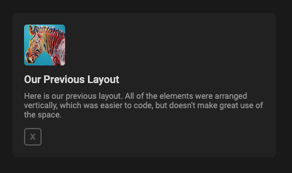
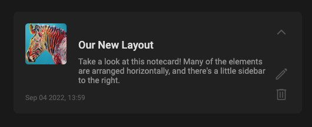
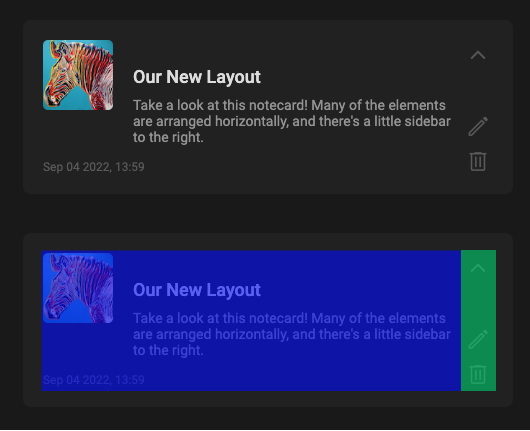
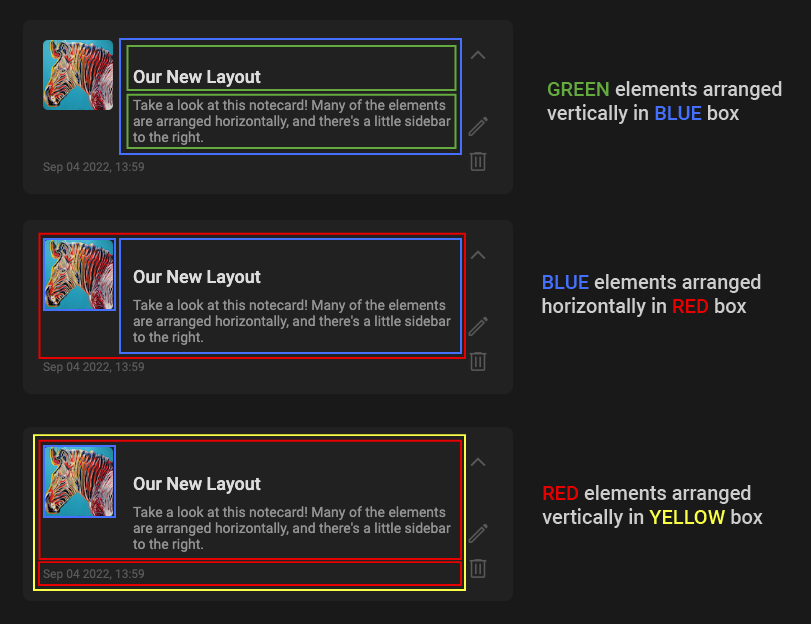

# Lab Exercise 02

Continuing with our development of a "sticky-note" application:

Last week, we created a simple notecard element for a ["sticky-note" application](https://interactive-structures.org/teach-pui/in-lab-examples/puinote-complete/). The element looked like this:



This week, we will create a more complex layout, that looks like this:



## Introduction

In this lab exercise, we will:
- Create a more complex layout for a single "notecard"
- Use *flex containers* to arrange child elements horizontally
- Understand layouts as "boxes within boxes"

## Setup

* Clone this repository, so you can access these files locally.

* If you've already forked and cloned the repository, you will need to fetch the latest copy. In Github Desktop, click "Current Branch", and at the bottom of the screen, click "Choose a branch to merge into main". Then select "upstream/main". 


## Width, Height, Padding, Margins (Review)

1. Start by familiarizing yourself with the structure in `index.html`. In the `<head>`, we've already loaded some fonts from Google Fonts, and linked a stylesheet. In `style.css`, we've set a default background color and font.

2. In `index.html`, create a `<div>` to represent our notecard, just as we did last time:

```
<div class="notecard">
</div>
```

3. In `style.css`, we will adjust the width, height, margins, padding, and box sizing.

```
.notecard {
    
    box-sizing: border-box;

    width: 450px;
    height: 150px;
    
    margin-left: auto;
    margin-right: auto;
    
    padding: 20px;
    
    border-radius: 8px;
    background-color: #212121;

}
```

You should see an empty gray notecard in the browser.

## Arranging Elements Horizontally

4. Take a look at the notecard design below. We can divide this notecard into two sections – a main area on the left (holding note text and images), and a sidebar on the right (holding collpase, edit, and delete icons).



5. In `index.html`, add two children to the notecard div. These two new elements will represent the left and right sections of the notecard. Add class names accordingly.
```
<div class="notecard">
    <div class="notecard-left">
        L
    </div>
    <div class="notecard-right">
        R
    </div>
</div>
``` 

6. In 'notecard.css`, add a different background color for each of the new notecard elements.
```
.notecard-left {
    background-color: blue
}
.notecard-right {
    background-color: green
}
```

Notice that by default, each of the elements expand to reach 100% of the parent width. Also notice that the elements are stacked on top of each other. How can we position these elements so that they are side by side?

Your first instinct might be to adjust the width of each element. We can give this a shot:

7. Set the width of `notecard-left` to 60% of its parent's width. Set the width of `notecard-right` to 40% of its parent's width.
```
.notecard-left {
    width: 60%;
    background-color: blue;
}
.notecard-right {
    width: 40%;
    background-color: green;
}
```

We've chosen proper widths, but the elements still appear on top of each other. As it turns out, regardless of their widths, block-level elements (such as `<div>`) will always stack on top of each other – each new `<div>` will be placed on a new line.


To make these elements sit side-by-side, on the same line, we will first modify the *parent* element.

8. In the `notecard` class, add a new display rule as shown:
```
    display: flex;
```

We have now converted `notecard` into a ***flex container***, and its two child elements, `notecard-left` and `notecard-right`, are now ***flex children***. Unlike standard block elements, which always appear on a new line, ***flex children*** try to get as close to each other as possible. Notice that `notecard-left` and `notecard-right` are now on the same line!

Also notice that by default, flex children stretch vertically until they reach the height of their parent element.

Take another look at the notecard mockup. Currently, the sidebar width is 40% of our notecard, but we would like it to be a fixed value:

9. Change the width of `notecard-right` to 30 pixels.

You should notice a couple changes – the sidebar width is now correct, but it is not on the right side of the notecard. Recall that by default, flex children try to sit as close to each other as possible. How can we push the sidebar to the right side?

One way to solve this is by adding a left margin, as we did earlier in this excercise.

10. Add an `auto` margin to the left side of `notecard-right`.
```
    margin-left: auto
```
Just as before, the browser expands this margin as much as it can, pushing `notecard-right` to the right side of its parent element.

Now, let's set the width of `notecard-left`. We'd like it to take up the remaining space in the notecard – it should be the full notecard width, minus the width of the 30 pixel sidebar. Let's look at a couple ways of doing this.

11. Use the CSS `calc()` function to set the width of `notecard-left`:
```
    width: calc(100% - 30px);
```

Since we're defining the width in terms of both a percentage *and* a pixel value, we have to use the CSS `calc` function. But this works! Check the browser, and you should see that `notecard-right` is 380 pixels wide.

Still, what happens if we later decide to change the width of `notecard-right`? Our width for `notecard-left` would now be outdated and incorrect.

What we would really like is for `notecard-left` to extend as far as it can go without squishing the 30 pixel sidebar. Perhaps if we set the width to `auto`?

12. For `notecard-left`, remove the previous width rule, and instead add `width: auto`.

No luck! But we've discovered one of the unique features of flex children. Unlike standard block elements, which expand as far as possible when using `auto` width, flex children will not expand beyond their contents when using `auto` width. Notice that as soon as the text ends, the background color ends.

What else can we try?

13. Add the following property to `notecard-left`:
```
    flex-grow: 1:
```

The `flex-grow` property applies only to flex children, and determines how they will behave when there is extra space around them. Since we set `flex-grow` to `1`, the `notecard-left` element will try to expand into the unused space. Looks good!

We are almost done with the sidebar layout, but there's a small hidden problem here. In `index.html`, modify the `notecard-left` content to include a long-ish sentence:

```
<div class="notecard-left">
    I've replaced the letter "L" with a long-ish sentence,
    that's a bit more representative of what actual
    content might look like.
</div>
```

Now take a look at what's happened to `notecard-right` (right click -> Inspect). Scroll down the box representation, and notice that the width of `notecard-right` is *less* than 30 pixels! The `notecard-left` element has tried to expand as far as it can, and in doing so, it's squeezing the `notecard-right` element.

Luckily, there is a simple fix here!

14. Add the following property to `notecard-right`:
```
    flex-shrink: 0:
```

Finally, we've solved our sidebar problem. Adding `flex-shrink: 0` will prevent `notecard-right` from shrinking below its specified width of 30 pixels.

To recap, when horizontally positioning elements, we two methods of setting the widths:

**Method 1:**
```
.notecard-left {
    width: calc(100% - 30px);
}
.notecard-right {
    width: 30px;
}
```

**Method 2:**
```
.notecard-left {
    flex-grow: 1;
}
.notecard-right {
    width: 30px;
    flex-shrink: 0;
}
```

Method 1 is (arguably) easier to understand, but if we decide to change the sidebar width, then we have to update both `notecard-left` and `notecard-right`. Method 2 is a bit trickier to understand, but it's more robust, as `notecard-left` adapts automatically.

---

## Boxes Within Boxes

Let's now add some content to the left side of the notecard. Take another look at the mockup – there are four elements that we need to place: (1) the image, (2) the note title, (3) the note body, and (4) the footer/timestamp.


One strategy for planning layouts is to create a system of "boxes within boxes". Then, for each box, commit to laying out the contents either horizontally or vertically.

For example, the note title and note body (highlighted in green, below) can both be contained within a parent box (highlighed in blue), and arranged vertically. Then, the zebra image and the blue box can be placed inside another parent box (highlighted in red) and arranged horizontally. Finally, the red box and the footer text can be arranged vertically inside of `notecard-left`.



Let's open `index.html` and try to create this layout. We'll specify all the elements first, and then add the styles and positioning.

15. Start at the outside and work inward – first create the "red" box and the footer text:


```
<div class="notecard-left">
    <div class="notecard-main-content">
    </div>

    <div class="notecard-footer">
        Footer text goes here
    </div>
</div>
```

16. Now add the zebra image and the "blue" box:

```
    <div class="notecard-main-content">
        

        <div class="notecard-text">
        </div>
    </div>
```

17. And finally, we add the note title and note body text.


```
        <div class="notecard-text">
            <div class="note-title">
                A Placeholder Title Goes Here
            </div>
            <div class="note-body">
                Here is some placeholder body text. And here is some more...
                and wait, here is even more! look at all this text! It just
                keeps going and going and going.
            </div>
        </div>
```


(Note that for the `` tag in step 22, we added two properties – the class and the image source. Also note that a closing tag is not necessary.)

If your placeholder sentences were long, you may notice that the content is "overflowing". Let's quickly fix that by modifying the height of the notecard:

18. Change the `height` property of `notecard` to `min-height: 150px`.

The notecard should expand vertically to contain all of the new content.

Let's style and position these elements. We'll start with the title and body text.

19. In `notecard.css`, create classes for the note title and body. Then update the font size, font weight, and font color:

```
.note-title {
  font-size: 18px;
  font-weight: 500;
}

.note-body {
  font-size: 14px;
  font-weight: 400;
  color: #939393;
}
```

In the Chrome Developer console, highlight the `notecard-text` element. Notice that it contains both the notecard title and notecard body text. We want to position this `notecard-text` element so that it sits to the right of the zebra image (`notecard-thumbnail`).

How will we do this? Just as before, we will convert `notecard-thumbnail` and `notecard-text` into *flex children*. Recall the flex children will try to get as close together as possible, meaning that they will sit on the same line by default.

20. Find the parent element of `notecard-thumbnail` and `notecard-text`. Add a `display: flex` rule, which will turn the child elements (`notecard-thumbnail` and `notecard-text`) into flex children.
```
.notecard-main-content {
    display: flex;
}
```

Check the mockup – the horizontal and vertical layout is complete! All that's left is fine-tuning.

---

## Image Sizing and Finishing Touches

21. Add a class for the thumbnail image, and adjust the width and height:

```
.notecard-thumbnail {
    width: 70px;
    height: 70px;

  object-fit: cover;
}
```

The `object-fit: cover` property positions the image so that it covers the entire 70x70 px area. It will be scaled down, but keep the same aspect ratio. Any parts of the image that fall outside of the 70x70 area will be clipped. This is useful for cases where our image isn't an exact square, but needs to fit into a square.

22. Add rounded corners to the image:
```
  border-radius: 5px;
```

Let's put some space between the image and the note text, so it looks more like the mockup.

23. Add a 26 pixel `margin-top` and 20 pixel `margin-left` to `notecard-text`.

24. Add a 10 pixel `margin-bottom` to `note-title`.

Almost there! All we have to do now it format the footer.

25. Add a `notecard-footer` class, and adjust the font and margins:
```
.notecard-footer {
    margin-top: 15px;
    font-size: 12px;
    color: #595959;
}
```

26. In `index.html`, swap the placeholder text in the footer with an example timestamp.
```
<div class="notecard-footer">
    Sep 1 2022, 12:30
</div>
```

And we're done! We will leave the sidebar empty for now.