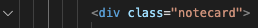

# Lab Exercise 5

## Introduction

In this lab exercise, we will:
- Create a data structure for storing all of our notecard objects
- Write functions for adding and removing notecards
- Clone DOM elements using HTML templates, and add them to the page

## Setup and Recap

1. Start by creating a `Notecard` class in `app.js`.

```
class Notecard {
    constructor(imageURL, title, body) {
    }
}
```

2. We will store the three input arguments as properties:
```
class Notecard {
    constructor(imageURL, title, body) {
        this.noteImageURL = imageURL;
        this.noteTitle = title;
        this.noteBody = body;
    }
}
```

3. Add a property called `element` that will corresponds to the `.notecard` element in the DOM. For now, let's leave this as `null`.
```
constructor(imageURL, title, body) {
    this.noteImageURL = imageURL;
    this.noteTitle = title;
    this.noteBody = body;

    this.element = null;
}
```

4. Go to the browser and open the console. As a test, try to create a new `Notecard` object by typing:
```
new Notecard('dummy image', 'dummy title', 'dummy body');
```
You should see a new `Notecard` object returned in the console, with `noteImageURL`, `noteTitle`, `noteBody`, and `element` properties. The `element` property is currently null, but we will eventually connect this to an HTML element visible in the browser.


## Storing Notecards

We need some data structure to store all of our `Notecard` objects. One good options is an `Array`, another good option is a `Set`. A `Set` is similar to an `Array`, but a `Set` does *not* allow duplicate entries. For this exercise, we will use a `Set`.

5. Create a `Set` to store our `Notecard` objects.
```
const notecardSet = new Set();
```

6. Create a function that allows us to make new notecards, and then adds them to the set:
```
function addNewNote(imageURL, title, body) {
    const notecard = new Notecard(imageURL, title, body);
    notecardSet.add(notecard);
}
```
Note that to add objects to a `Set`, we use the `add` method. (For an `Array`, we would use `push`).

7. At the end of the `addNewNote` function, return a reference to the newly created notecard. This will come in handy later.
```
function addNewNote(imageURL, title, body) {
    const notecard = new Notecard(imageURL, title, body);
    notecardSet.add(notecard);
    return notecard;
}
```

8. Let's create some example notecards to test out the `addNewNote` function.
```
const notecardOne = addNewNote(
  "assets/warhol-rhino.png",
  "The first note title",
  "The first note body"
);
const notecardTwo = addNewNote(
  "assets/warhol-frog.png",
  "The second note title",
  "The second note body"
);
```

9. Head over to the console. Type `notecardSet` and take a look at what is returned. In the console, you should see a `Set` with two `Notecard` objects inside.

10. Try adding a third note. In the console, type:
```
addNewNote("test image", "test title", "test body");
```
Then, type `notecardSet` again. You should now see three `Notecard` objects in the set.

We have a data structure that we can add items to – this is good progress! Now we need to display these items on the page.


## Iterating through a Set (or Array)

We have a set that contains `Notecard` objects. We need to loop through the set and create a DOM element for each `Notecard` object.

11. Create a `for...of` loop that iterates through the `notecardSet`. (You can use this type of loop for an `Array` too!)
```
for (const notecard of notecardSet) {
  console.log(notecard);
}
```

12. For each notecard, add a call to the function `createElement`. We will implement this function in a moment.
```
for (const notecard of notecardSet) {
  console.log(notecard);
  createElement(notecard);
}
```

13. Add the `createElement` function. For now, just log a message.
```
function createElement(notecard) {
    console.log('Creating an Element!')
}
```

14. Go to the console, and you should see the messages printed – one for each of the two notecards in our set.


## Creating Elements with HTML Templates

In `index.html`, take a look at the `.notecard` element on line 48. We'd like to duplicate this HTML for each notecard we add, but we don't want to manually rewrite it. One way to achieve this is by using the HTML `<template>` tag.

15. In `index.html`, find the `.notecard` element on line 48. Next to the line number in VSCode, click on the arrow to collapse the HTML element.

 

16. Wrap the notecard div with a `<template>` element.
```
<template id="notecard-template">
    <div class="notecard">
        ...
    </div>
</template>
```

Head back to the browser. Notice that the notecard element is no longer displayed on the screen. HTML inside the `<template>` tags is not rendered by the browser. But we can use JavaScript to *copy* the template and add these copies to the DOM. (As many copies as we want!)

17. Back in the `createElement` function, we first grab a reference to the notecard template:
```
function createElement(notecard) {
  const template = document.querySelector('#notecard-template');
}
```

18. We then get the `content` inside the template and copy it using the `cloneNode` method. (We use the parameter `true` to tell the browser that we want a *deep copy*, which will include the notecard and all its child elements.)
```
function createElement(notecard) {
  const template = document.querySelector('#notecard-template');
  const clone = template.content.cloneNode(true);
}
```

19. We then store a reference to the newly copied element. (Display the element with `console.log` so we can take a look.)
```
function createElement(notecard) {
  const template = document.querySelector('#notecard-template');
  const clone = template.content.cloneNode(true);
  notecard.element = clone.querySelector('.notecard');

  console.log(notecard.element);
}
```

If you look in the console, you should see the newly created HTML nodes. Now that the nodes have been created, we need to add them to the page!

20. In our `createElement` function, we first grab a reference to `.notecard-list`, a `<div>` that will contain all our notecards.
```
function createElement(notecard) {
  const template = document.querySelector('#notecard-template');
  const clone = template.content.cloneNode(true);
  notecard.element = clone.querySelector('.notecard');

  const notecardListElement = document.querySelector('#notecard-list');
}
```

21. We then add our newly created elements. You can use either the `append` or `prepend` method. The `append` method puts the new element at the end of the parent (after any existing children). The `prepend` method puts the new element at the beginning of the parent (before any exisiting children).
```
function createElement(notecard) {
  const template = document.querySelector('#notecard-template');
  const clone = template.content.cloneNode(true);
  notecard.element = clone.querySelector('.notecard');

  const notecardListElement = document.querySelector('#notecard-list');
  notecardListElement.prepend(notecard.element);
}
```

22. Check out the browser. Notice that there are now two notecards! The data is not yet updated, but we know how to fix that.

23. At the end of of `createElement`, add a call to a function called `updateElement`, which we will implement in the next step.

```
function createElement(notecard) {
  ...
  updateElement(notecard);
}
```

24. Implement the `updateElement` function, which will take a `Notecard` object as an argument, and update the appropriate DOM element. As before, use `querySelector` to get references to the child elements:
```
function updateElement(notecard) {
    const noteImageElement = notecard.element.querySelector('.notecard-thumbnail');
	const noteTitleElement = notecard.element.querySelector('.note-title');
	const noteBodyElement = notecard.element.querySelector('.note-body');
}
```

25. Then, update the DOM elements using the `Notecard` properties:
```
function updateElement(notecard) {
    const noteImageElement = notecard.element.querySelector('.notecard-thumbnail');
	const noteTitleElement = notecard.element.querySelector('.note-title');
	const noteBodyElement = notecard.element.querySelector('.note-body');

    noteImageElement.src = notecard.noteImageURL;
    noteTitleElement.innerText = notecard.noteTitle;
    noteBodyElement.innerText = notecard.noteBody;
}
```

26. Go to the browser, and you should notice two updated notecards! In the console, let's try to add a third. Type:
```
const testNote = addNewNote('./assets/warhol-eagle.png', 'title three', 'body three');
createElement(testNote);
```

A third note should appear! We can now dynamically add notecards.


## Deleting Notecards

We will now create a function to delete notecards.

27. Create a function called `deleteNote` that takes a `Notecard` as input, and removes the appropriate element from the DOM.
```
function deleteNote(notecard) {
    notecard.element.remove();
}
```

28. Remember that we are also storing our notecard elements in a `Set`! We can't just delete the graphical representation, we have to delete the data as well. Use the `delete` method to remove this notecard from `notecardSet`.
```
function deleteNote(notecard) {
    notecard.element.remove();
    notecardSet.delete(notecard);
}
```

29. Go to the console and test out this method. (Try typing `deleteNote(notecardOne`), for example). Take a look at `notecardSet` before and after you run the function.

Our last task is to attach this "delete" function to the trash can button on the notecards. Let's do this by going back to the `createElement` function and adding an event listener.

32. In `createElement`, use `querySelector` to get a reference to the trash can icon.
```
function createElement(notecard) {
    ...
    const btnDelete = notecard.element.querySelector('.icon-delete');

    const notecardListElement = ...
    ...
}
```

30. Attach a `click` listener to the trash can icon (which we have called `btnDelete`). Here, we will wrap our call to `deleteNote` in an [arrow function](https://developer.mozilla.org/en-US/docs/Web/JavaScript/Reference/Functions/Arrow_functions). (You will not be tested on arrow functions, but in cases such as this, it can make writing code a bit easier.)

Effectively, this syntax translates to: "When the trash-can button is clicked, run all the instructions inside the curly brackets `{ }`." 
```
function createElement(notecard) {
    ...
    const btnDelete = notecard.element.querySelector('.icon-delete');
    btnDelete.addEventListener('click', () => {
        deleteNote(notecard);
    });

    const notecardListElement = ...
    ...
}
```

If we did not use an arrow function, then we would not have been able to pass `notecard` as an argument to `deleteNote`.

31. Head over to the browser. You should be able to delete the notecards!
