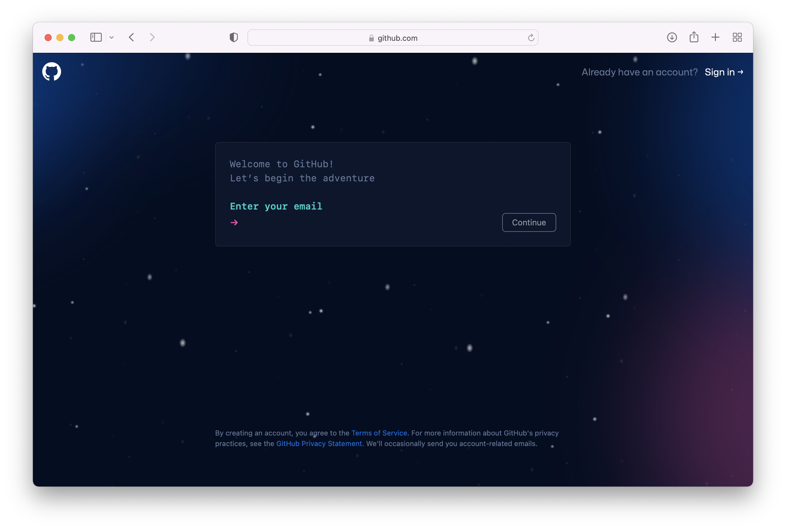
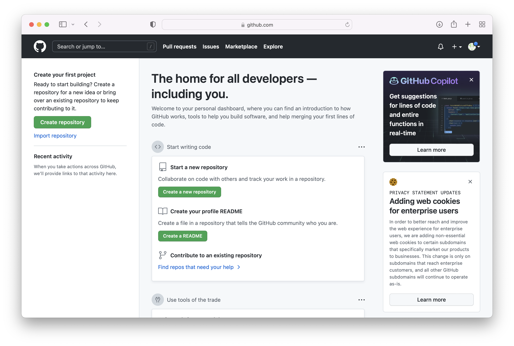
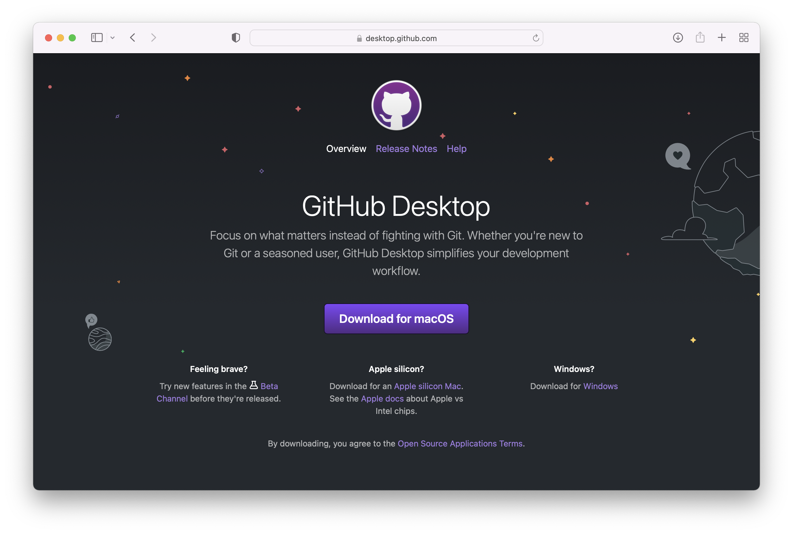
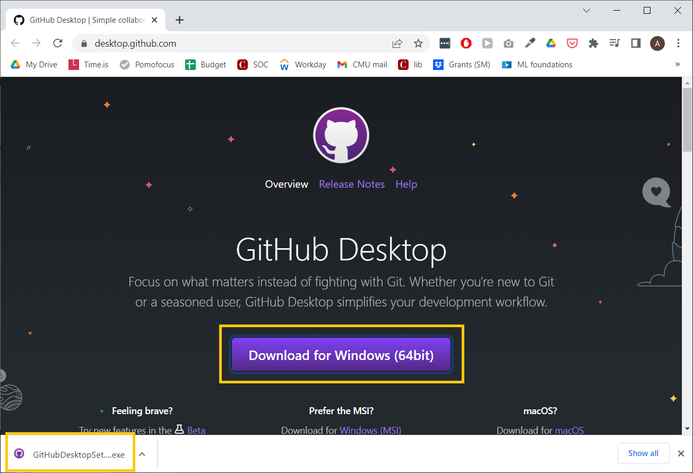
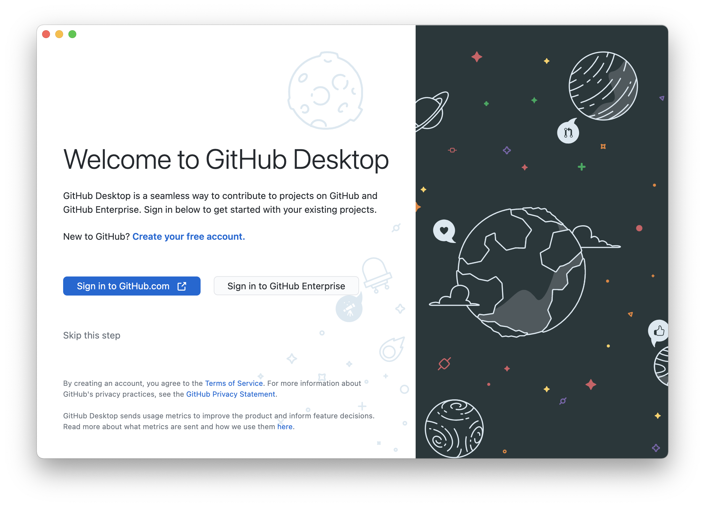
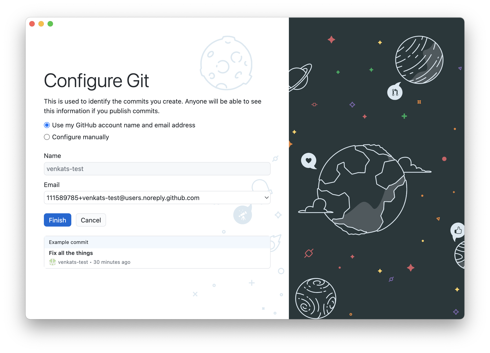

# GitHub Setup

## What is `git`?

When you write code, you often need to keep track of what the code looked like in the past. Let's say on Monday you write a piece of code that works, and on Friday you come back and write a few more lines. But suddenly you find that the code you wrote on Monday no longer works. What happened?

This is where `git` comes in. When you write code, you can periodically tell `git` to keep track of how your code looked at different points in time. Then, you can jump back and forth between versions of your code to compare and understand what might have caused issues. You can even combine bits and pieces from multiple versions to create _new_ versions.

This is called **version control**, and it's the reason why you'll need `git` in practically every future software project you do!

**What is GitHub?** Normally, `git` just runs in a command line on your computer, and it can be tricky to understand what it's doing! GitHub gives you a nice visual app called GitHub Desktop that makes it a lot easier to use `git`. And even better, when you want to collaborate with others (or just turn in your homework assignments), GitHub helps by putting your versions on the Internet for others to see.

So, are you ready to set up `git` and GitHub and achieve your version control dreams? Let's jump in!

## Make a GitHub Account

You'll need a GitHub account to upload your assignments and code, so let's make one now.
Note that if you already have a GitHub account and use GitHub pages to host a personal website, you should make another account for the homework assignments. 

Go to [github.com](https://github.com) and click **Sign Up** in the top right corner.

Enter an email address, and choose a password and username. Your username is how people will see and interact with you on GitHub, so make sure it's something you don't mind using in a semi-professional setting!

When you're done, you should see this page:

You can skip these personalization steps for now. GitHub offers a paid plan that lets you create private codebases, and you can apply to get access to that plan for free if you provide your student credentials! But you don't have to do that for the class unless you want to.

After that's done, you should see this page:

Alright, on to making GitHub work on your local computer!

## Installing GitHub Desktop

Like we mentioned earlier, GitHub Desktop is a nice user interface that lets you use `git` without having to use a command line, and it helps you synchronize code between your local computer and online. You can do everything that you can do in GitHub Desktop through the command line (and many software engineers do), but this app just makes things easier. :)

To start, go to the [GitHub Desktop home page](https://desktop.github.com).

|             |                      |
| ----------- | -------------------- |
|  **On Mac:** If you have a newer Mac model with an *M1 or M2 chip*, click the link that says *"Download for an Apple silicon Mac."* Otherwise, just click the big purple download button. When it's done downloading, click the download to unzip the file, and view it in the Finder. You should now see the purple icon for GitHub Desktop in your Downloads folder. Drag the icon into the Applications folder for safekeeping, and it should be installed! |  |
| **On Windows:** Click the big purple button to download. After the download is completed, open the EXE and install it on your system by going through the installation wizzard.  |  | 

When you open the GitHub Desktop app for the first time, you should see this welcome page:

Click the **Sign in to GitHub.com** button, and authorize the application in the page that appears. When that's done, you should see the Configure Git page in the GitHub Desktop app:

These settings should be good to go, so just hit Finish.
