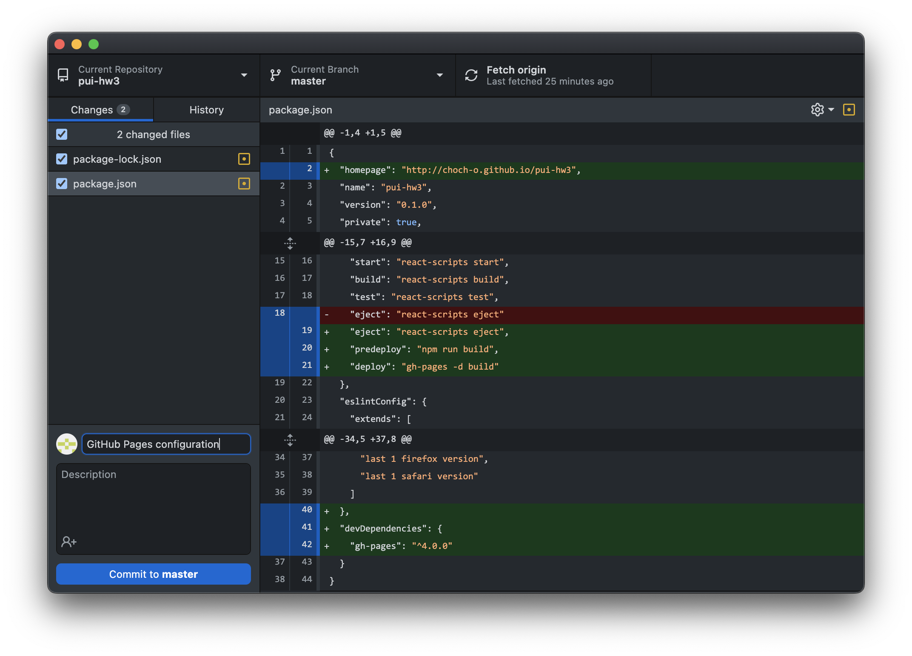

# Deploying React Homework Assignments on GitHub

_This tutorial assumes you have set up [GitHub](./GithubSetup.md) and your development environment ([Mac](./DeveloperEnvironment--Mac.md) or [Windows](./DeveloperEnvironment--Win.md)) correctly. If you haven't, go through those tutorials first!_

For the assignments in this class, you will upload all code to a single repository (a.k.a. a folder containing code) in your GitHub account. We'll use a service called GitHub Pages to "serve" that repository as a public website.

## Creating a new React project

1. For React projects, we recommend you start by creating a repository named `pui-hw#` using `create-react-app`. We'll use `pui-hw3` as an example for this tutorial.
Enter the following command in the terminal. 

```
create-react-app pui-hw3
```

## Configuring for GitHub Pages

2. Install GitHub Pages package as a dev-dependency.

```
cd pui-hw3
npm install gh-pages --save-dev
```

3. Add the `homepage` property to `package.json` file at the top level.

```
"homepage": https://<github-username>.github.io/<repo-name>"
```
`<github-username>` should be your GitHub username, and `<repo-name>` is the name of your GitHub repository.

4. Add the `predeploy` and `deploy` in the existing `scripts` property.
```
"scripts": {
  ...
  "predeploy": "npm run build",
  "deploy": "gh-pages -d build"
}
```

Your `package.json` file should now look like this.


## Create a GitHub repository

5. Initialize a GitHub repository on your local setup using GitHub Desktop. Click the `Add an Existing Repository from your Hard Drive...` button.


6. Locate the project folder to add the local repository.


7. Publish repository to GitHub. Click the `Publish repository` button at the top bar. Make sure that you name the repository same as what you wrote in the `homepage` url in `package.json` in Step 3. Uncheck `Keep this code priavte`. Complete by clicking `Publish Repository`.


## Deploy

8. Deploy the project to GitHub Pages by running the following command. Make sure you saved the `package.json` file after modifying. 
```
npm run deploy
```

After a minute or less, you should be able to open the deployed page in the url (`https://<github-username>.github.io/<repo-name>`) you put for `homepage`.


**Important:** Take **your** URL and add it to the description of your repository. 


When you go to your URL, you should see the published website!


## Editing, committing, and pushing

You can open up your repo in VS Code and edit it - you can either find it by opening up VS Code and browsing for the directory, or press the **Open in Visual Studio Code** button on the repo page in GitHub Desktop.

Let's say you complete part of the assignment and you're pretty happy with the results! You should **commit** your changes frequently, to make sure that if your app ever breaks, you can go back and see what might have gone wrong. To do that, open up GitHub Desktop and you should see a list of files that you've changed since the last commit:



Be sure that only the files you want to save in this commit are checked in the left sidebar. Then, type a commit message (be descriptive and summarize the changes you made, like "Updated homework text for clarity") and click **Commit to main**.

Now that your changes are committed _locally_, you have to "push" them to GitHub, where they will show on your published website. To push, simply press the **Push origin** button, either at the top of the GitHub Desktop page or the blue one (both buttons do exactly the same):


You should see the new commits reflected on your published site! Note that only the changes that you've actually committed will be visible, not just any modifications you've made on your local machine. So if you have temporary modifications that don't quite work yet, you can hold off on selecting them for the commit (or you can [commit them to a branch](https://medium.com/@zandra.harner/github-branching-and-merging-using-github-desktop-ba4f7d59fdb9)).
