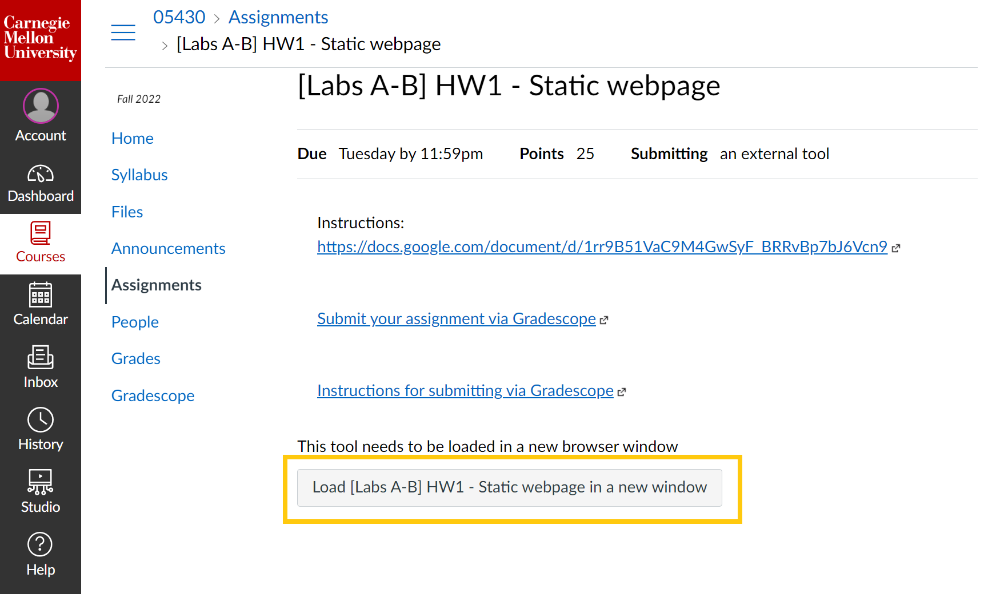
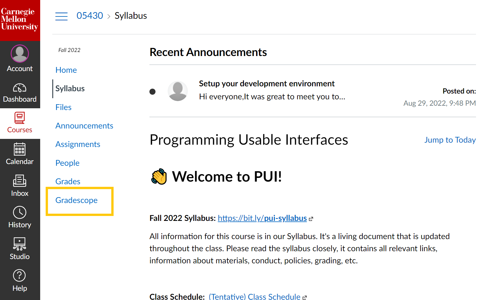
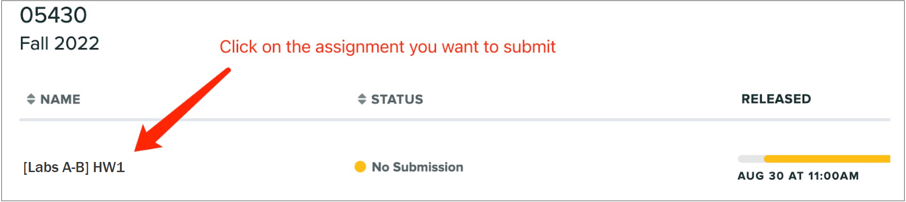
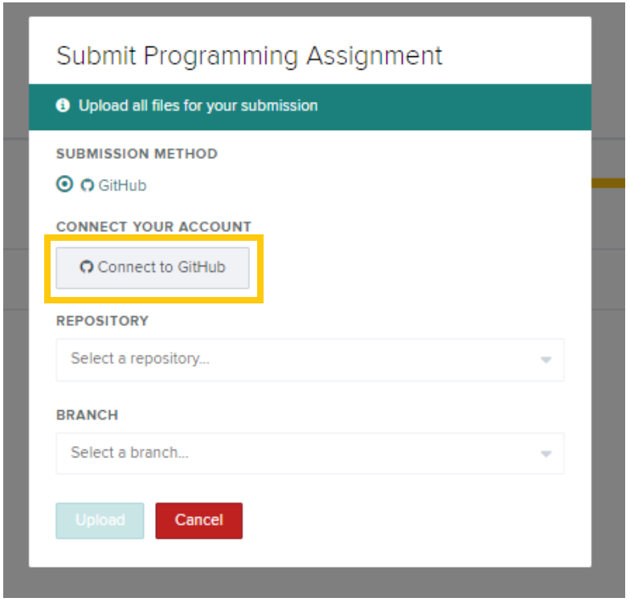
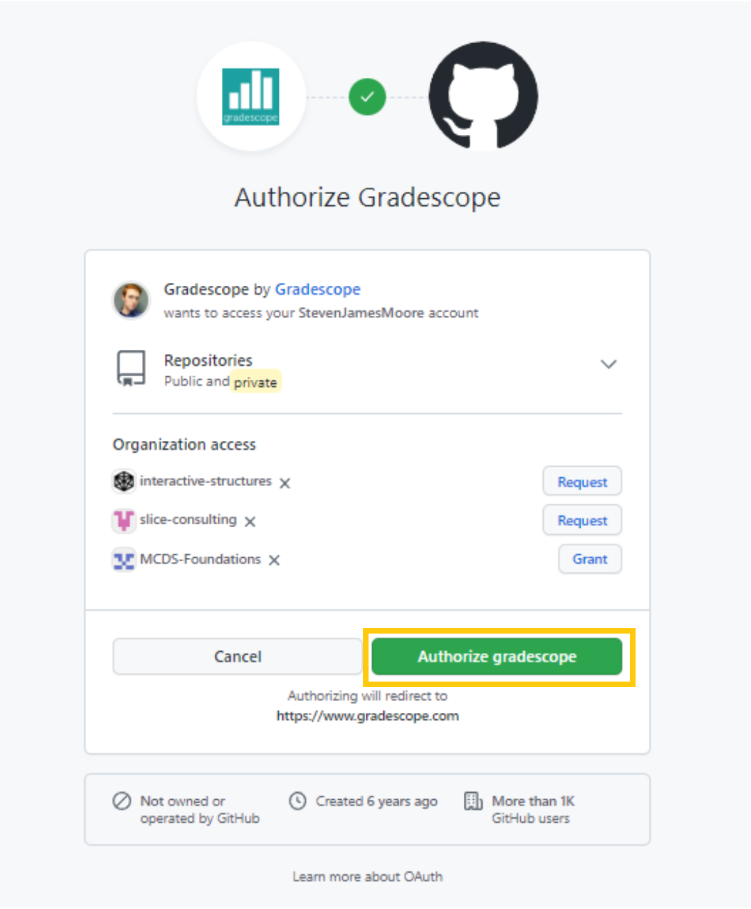
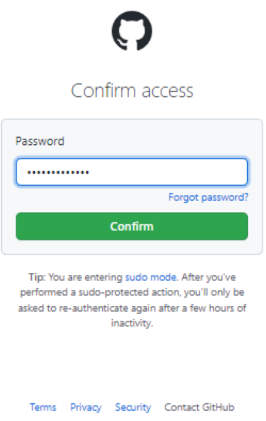
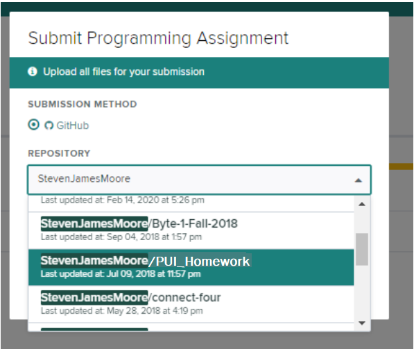
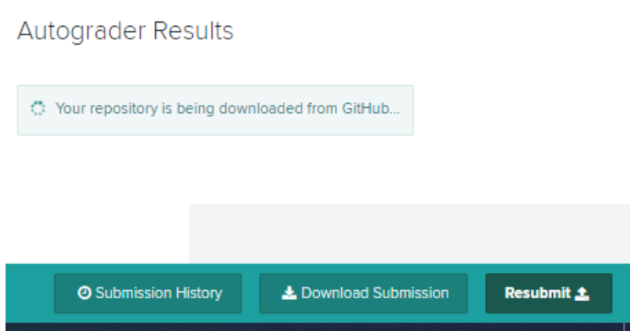
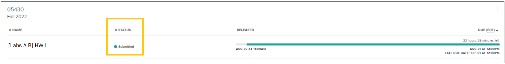
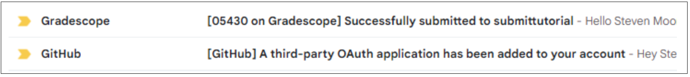

# Submitting your Homework on Gradescope

We wil use Gradescope for assignments in this course. For your first submission, you will have to connect your GitHub account to Gradescope. 

**Add the URL of your website:**

We will need to evaluate your **deployed** website of your homework. In your repository, add a README.md or README.txt that contains the URL to the website running online, like [this example](https://github.com/interactive-structures/teach-pui-example). 
(We assume that you did the [homework deployment tutorial](./HWDeployment.md) at this point.)

To submit your homework, follow the steps below.

## 1. Access the assignment on Gradescope

You can access Gradescope two ways:

<table>
<tbody>
  <tr>
    <td>
    1. Go to the Canvas Assignment and click the gray button:  

    </td>
    <td>
    2. You can go directly to Gradescope using the sidebar menu:  

    </td>
  </tr>
</tbody>
</table>

After entering Gradescope, you will see the assignment names. Click the assignment that you want to submit to.

  

## 2. Connect your GitHub to Gradescope

The first time you submit using Gradescope, you’ll be prompted to **connect your Github account**. When you get this prompt, click the “Connect to Github” button:

  

Log into your Github account, then Gradescope should automatically find your account and ask if you want to authorize Gradescope. If it does not find it, be sure to login in at the prompt.

  

Once you hit *"authorize"*, it will ask for your password. Ensure this is the Github account that you’re using for PUI and the homeworks. 

  

Once it’s linked, you can use the dropdown menu to select the repository. If you have multiple repositories, make sure to select the repository you are using for PUI that will contain all the homework files.

  

Once you’ve selected the repository, you’ll need to select the branch, you will likely only haven the “master” branch available, so select that.

  

## 3. Upload to Gradescope

Once you set these field identifying the repository, click the “Upload” button and you should receive a confirmation like below.

  

After you close that prompt, you may see a screen about an autograder, you can ignore it. However, on this screen you can resubmit if needed (using the “Resubmit” button in the bottom right of the screen). Note, if you make any changes to the files on your Github, you’ll need to resubmit.

  

Gradescope should show the status "Submitted".

  

You should also receive an email stating you linked your Github account to Gradescope and that you’ve submitted the assignment.

  

